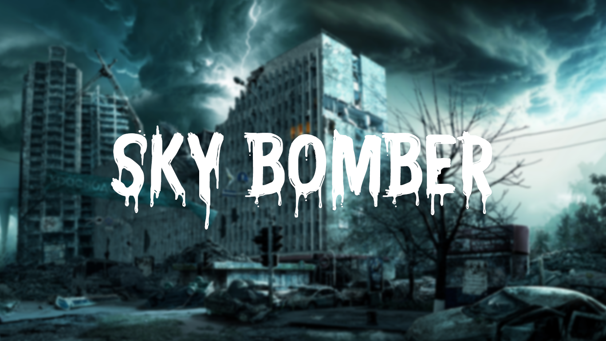
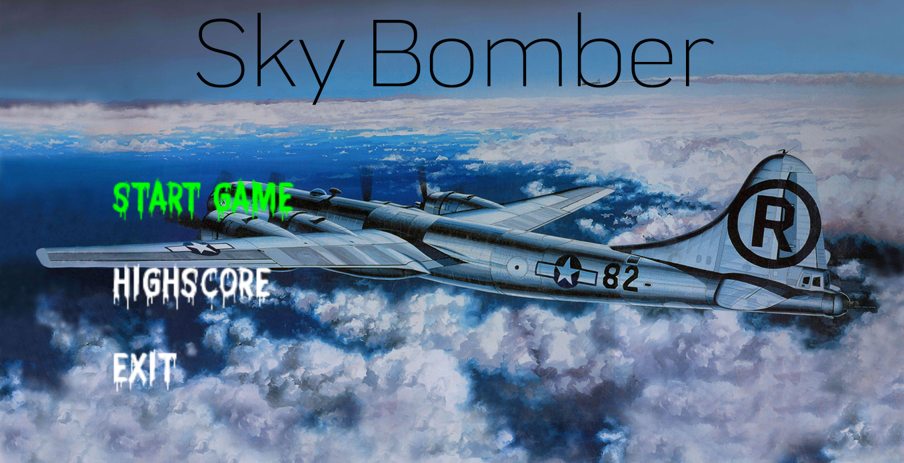
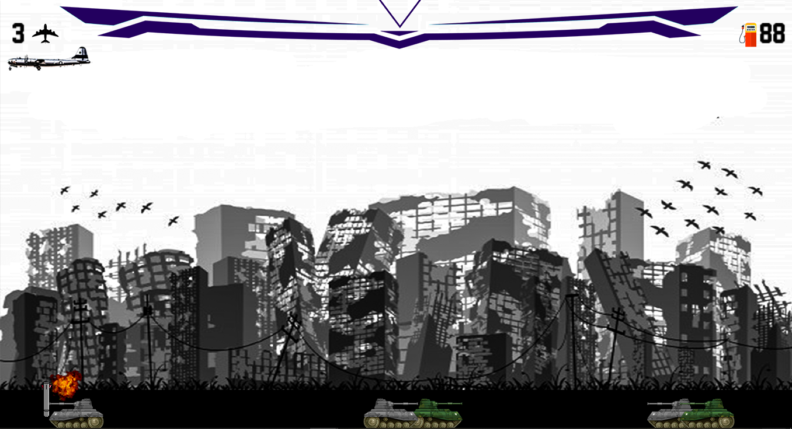

# Sky Bomber

## Abstract

You are the only remaining pilot of a fighter jet assigned to obliterate everything and anything within your sight. Apply your projectile motion wits and be as accurate as possible while throwing the missiles. But hurry up ! The fuel is running low.

## Build instructions

Please utilize the ``C++Project.sln`` file to create a Visual Studio project and set the target to *x86* environment.

## Screenshots

## Contributors

[Aayush Acharya](https://github.com/aayushacharya)

[Anjil Bishowkarma](https://github.com/anzeal)

[Nirajan Basnet](https://github.com/QuizzerNirajan)

## Special thanks

[Rabin Adhikari](https://github.com/rabinadk1)
